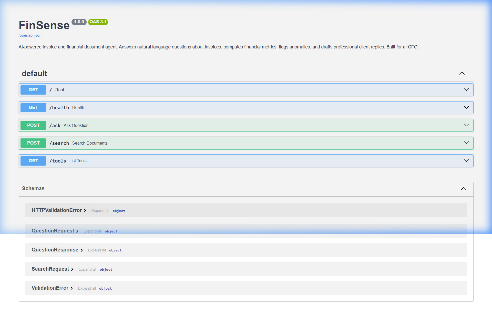
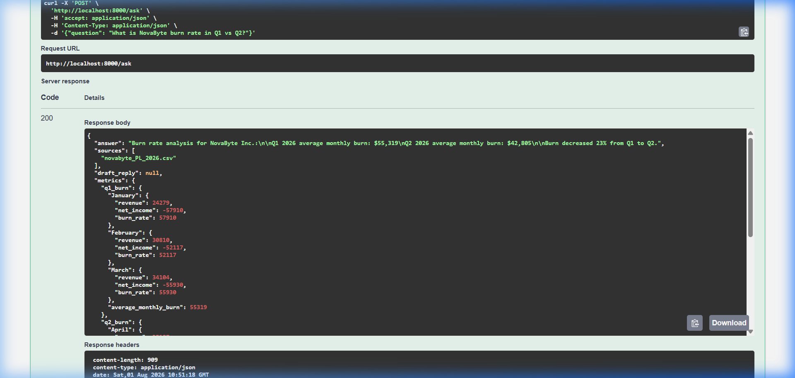
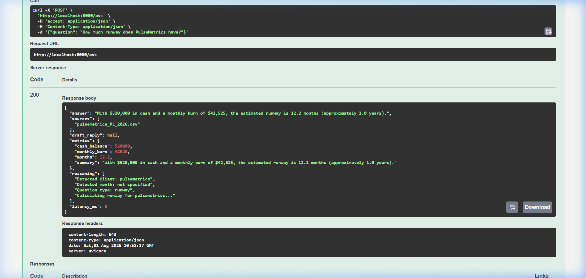

# FinSense

AI-powered financial document assistant for startup finance teams. Helps teams answer invoice questions, track burn rate, detect expense anomalies, and generate month-end analysis. Humans stay in control: AI handles retrieval and computation, your team makes decisions. All data stays on your infrastructure.

## Screenshots

**Health check: 84 documents indexed and ready**


**Swagger UI: all endpoints, fully interactive**



**`/ask`: NovaByte burn rate Q1 vs Q2 (pure math, no LLM)**



**`/ask`: PulseMetrics runway at current burn**



## What it does

**Invoice Q&A** - Ask any natural language question about a client's invoice. The agent retrieves the right document, cross-references line items, and gives you a direct answer with cited sources.

**Month-End Analysis** - Feed it a P&L statement and it generates a CFO-level summary paragraph. Revenue, burn, margin, top expenses, anomalies, and runway. The same analysis finance teams produce, powered by RAG and structured financial tools.

**Anomaly Detection** - Automatically flags unusual month-over-month changes in expense categories. Catches spikes, drops, and new line items that would otherwise take manual review to spot.

**Period Comparison** - Compare Q1 vs Q2 (or any two periods) across every expense category with deltas and percentage changes.

**Draft Replies** - Generates professional client-facing email replies to invoice questions. A human reviews and sends. The agent does the research and the first draft.

**MCP Server** - The entire pipeline is exposed as an MCP server with 6 typed tools. Claude or any external LLM agent can call into FinSense programmatically.

## Architecture

```
Question
    |
    v
[Question Parser] --> detect client, month, question type
    |
    v
[Router] --> invoice_explanation | comparison | burn_rate | runway | anomaly | month_end | draft_reply
    |
    v
[RAG Pipeline]                    [Financial Tools]
  FAISS index                       burn rate calculator
  HuggingFace embeddings            runway estimator
  Cross-encoder reranker            margin tracker
  Financial-aware chunking          anomaly detector
    |                                    |
    v                                    v
[Response Builder] --> structured answer + optional email draft
    |
    v
[FastAPI / MCP Server] --> REST endpoints + MCP typed tools
```

## Why these technical decisions

**FAISS over Pinecone or Qdrant.** Finance teams handle sensitive financial data for venture-backed startups. Client invoices, P&L statements, and cash flow data are sensitive. FAISS runs entirely local with zero external API calls. No data leaves the server. For an accounting firm or finance team, this is not a nice-to-have. It is a compliance requirement.

**Cross-encoder reranking.** When you have 300+ clients with similar monthly invoices, vanilla cosine similarity returns too many near-matches from the wrong client or the wrong month. The cross-encoder reranker scores each candidate against the actual query and pushes the correct document to the top. This is the difference between "found an invoice" and "found the right invoice."

**Financial-aware chunking.** Standard text splitters break financial documents in ways that make them useless. The number "$15,234" means nothing without its column header (AWS Infrastructure), its section (Operating Expenses), and its period (March 2026). The chunker keeps table headers attached to their rows, groups line items with their categories, and prefixes every chunk with client and period metadata.

**Deterministic tools over LLM calls for math.** Burn rate, runway, margin, and anomaly detection are pure math. The agent calculates them directly from the structured data instead of asking an LLM to do arithmetic. This is faster, cheaper, and never hallucinates a number.

**Multi-step agent routing.** The agent does not treat every question the same way. "Explain the charge" triggers a single-invoice retrieval. "Why is this month higher" triggers a multi-invoice comparison. "Flag anomalies" triggers the financial tools. The router classifies the question first, then picks the right pipeline. This is how an experienced accountant thinks.

## Key Principles

- Data never leaves your infrastructure: FAISS runs local
- Math is never wrong: deterministic tools, no LLM arithmetic
- Right tool for right question: router sends burn rate to calculators, not to RAG
- Human stays in control: AI retrieves and computes, team reviews and decides
- Pluggable: MCP server lets any LLM agent call these tools

## Known Limitations & Planned Improvements

- Ambiguous client references fail: "the startup" instead of "NovaByte" breaks retrieval
- Cross-client comparisons not supported yet
- Hallucinates when data isn't in the index: needs confidence threshold + "I don't know" fallback
- Chunking quality degrades on PDFs longer than 20 pages
- No streaming responses yet

Planned fixes:
- Client disambiguation step before retrieval
- Confidence-based fallback using retrieval scores
- Sliding window chunking for long documents


## MCP Tools

| Tool | What it does |
|------|-------------|
| `query_invoices` | RAG search over all ingested invoices. Returns relevant chunks with relevance scores. |
| `calculate_metrics` | Computes burn rate, runway, gross margin, and month-over-month growth for a client. |
| `compare_periods` | Compares two time periods side by side. Shows deltas and percentage changes for every category. |
| `flag_anomalies` | Detects unusual spikes, drops, and new expenses. Flags severity levels. |
| `generate_analysis` | Produces a CFO-level month-end analysis paragraph from financial data. |
| `draft_reply` | Drafts a professional client-facing email reply to an invoice question. |

## Sample queries

```
"Can you explain the $12,500 charge on GreenThread's February invoice?"

"Why is NovaByte's March invoice higher than February?"

"What is NovaByte's burn rate in Q1 vs Q2?"

"How much runway does PulseMetrics have at current burn?"

"Flag anything unusual in NovaByte's March expenses"

"Generate a month-end summary for GreenThread for April 2026"

"Draft a reply to NovaByte asking why their May invoice includes a $3,000 charge they did not expect"
```

## Quick start

```bash
# Clone and enter the repo
git clone https://github.com/Parthjain171/FinSense.git
cd FinSense

# Install dependencies
pip install -r requirements.txt

# Generate sample data (invoices, financials, questions)
python data/generate_sample_data.py

# Start the server
uvicorn app.main:app --reload

# Or use Docker
docker-compose up --build
```

The API will be available at `http://localhost:8000`. Hit `/docs` for the interactive Swagger UI.

## Try it

```bash
# Ask a question
curl -X POST http://localhost:8000/ask \
  -H "Content-Type: application/json" \
  -d '{"question": "Why is NovaByte March invoice higher than February?"}'

# Search documents
curl -X POST http://localhost:8000/search \
  -H "Content-Type: application/json" \
  -d '{"query": "GreenThread February invoice", "top_k": 3}'

# List MCP tools
curl http://localhost:8000/tools

# Health check
curl http://localhost:8000/health
```

## Project structure

```
FinSense/
  app/
    main.py                  FastAPI server with all REST endpoints
    agents/
      invoice_agent.py       Multi-step agent with question routing
    rag/
      pipeline.py            FAISS index, embeddings, cross-encoder reranking
      chunker.py             Financial-aware document chunking
    parsers/
      pdf_parser.py          Invoice PDF extraction with table parsing
    tools/
      financial_tools.py     Burn rate, runway, margin, anomaly detection
  data/
    generate_sample_data.py  Creates realistic sample invoices and financials
    sample_invoices/         18 invoice PDFs across 3 fictional clients
    sample_financials/       P&L, Balance Sheet, Cash Flow CSVs
    sample_questions/        15 evaluation questions with expected outputs
  Dockerfile
  docker-compose.yml
  requirements.txt
```

## Sample data

Three fictional startup clients:

**NovaByte Inc.** (Seed, SaaS) - $5K/month base, with add-ons for tax prep and financial modeling in specific months.

**GreenThread Commerce LLC** (Series A, E-commerce) - $12K/month base (accounting + finance advisory), with add-ons for audit prep and 409A valuation.

**PulseMetrics Health Inc.** (Pre-seed, HealthTech) - $3K/month base, with a PeopleOps add-on and a scope reduction in later months.

Each client has 6 months of invoices, P&L statements, balance sheets, and cash flow statements. The data is realistic but entirely fictional. No real client data was used.

## Tech stack

- **Python** - core language
- **FastAPI** - REST API server
- **FAISS** - vector similarity search (local, no external calls)
- **sentence-transformers** - embeddings (all-MiniLM-L6-v2)
- **CrossEncoder** - reranking (ms-marco-MiniLM-L-6-v2)
- **pdfplumber** - PDF text and table extraction
- **reportlab** - sample invoice PDF generation
- **pandas** - financial data processing
- **Docker** - containerized deployment

---

Built by [Parth Jain](https://github.com/Parthjain171) | [LinkedIn](https://www.linkedin.com/in/parth-jain-a76746166/)

